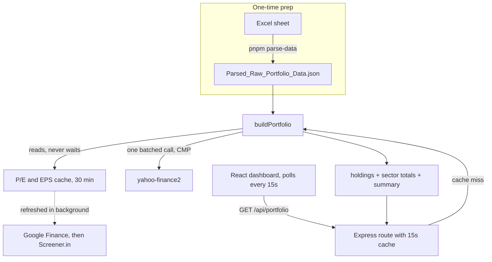

# Stock Portfolio Dashboard
A small app based on fixed static data. It showcases a stock portfolio with updated current market prices, P/E and EPS which refreshes every 15 seconds.

## Setup
### Server
* Install dependencies
    ```bash
    cd server
    pnpm install
    ```
* Create a `.env` following the structure present in **`.env.example`**.
* To generate the cleaned JSON data from Raw Excell sheet (run it if changes in data):
    ```bash
    pnpm parse-data
    ```
* Start the server & verify by visiting `http://localhost:[PORT]/health`
    ```bash
    pnpm dev
    ```
### Frontend
* Install dependencies
    ```bash
    cd client
    pnpm install
    ```
* If required u can have a environment variable for `API_URL` for fetching purposes.
* Start dev server
    ```bash
    pnpm run dev
    ```

## System Flow


## API Response Schema
```json
{
  "source": "live | cache ", // "stale"
  "updatedAt": "ISO-8601 timestamp",

  "summary": {
    "totalInvestment": "number",
    "totalPresentValue": "number",
    "totalGainLoss": "number",
    "totalReturnPercent": "number"
  },

  "sectors": {
    "<sector-name>": {
      "totalInvestment": "number",
      "totalPresentValue": "number",
      "totalGainLoss": "number",
      "holdings": [
        "<holding>"
      ]
    }
  },

  "holdings": [
    {
      "id": "number",
      "sector": "string",
      "name": "string",
      "ticker": "string",
      "exchange": "NSE | BSE",
      "quantity": "number",
      "purchasePrice": "number",
      "investment": "number",

      "cmp": "number",
      "presentValue": "number",
      "gainLoss": "number",
      "gainLossPercent": "number",

      "portfolioPercent": "number",
      "peRatio": "number | null",
      "latestEarnings": "number"
    }
  ]
}
```


## In-memory Cache Usage & Limits
* CMP: 1 batched call every 15 seconds. Simultaneous requests will share an inflight fetch.
* P/E & EPS: These values don't change often, hence they are cached separately for 30mins and refreshed in the background. 
* Multiple Fallbacks at place utilising Google, Screener & Yahoo. Addition of a 800ms delay for each request was necessary when manual scarping to prevent timeouts.   